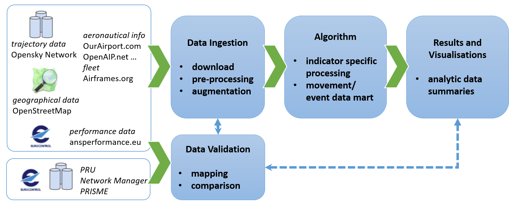
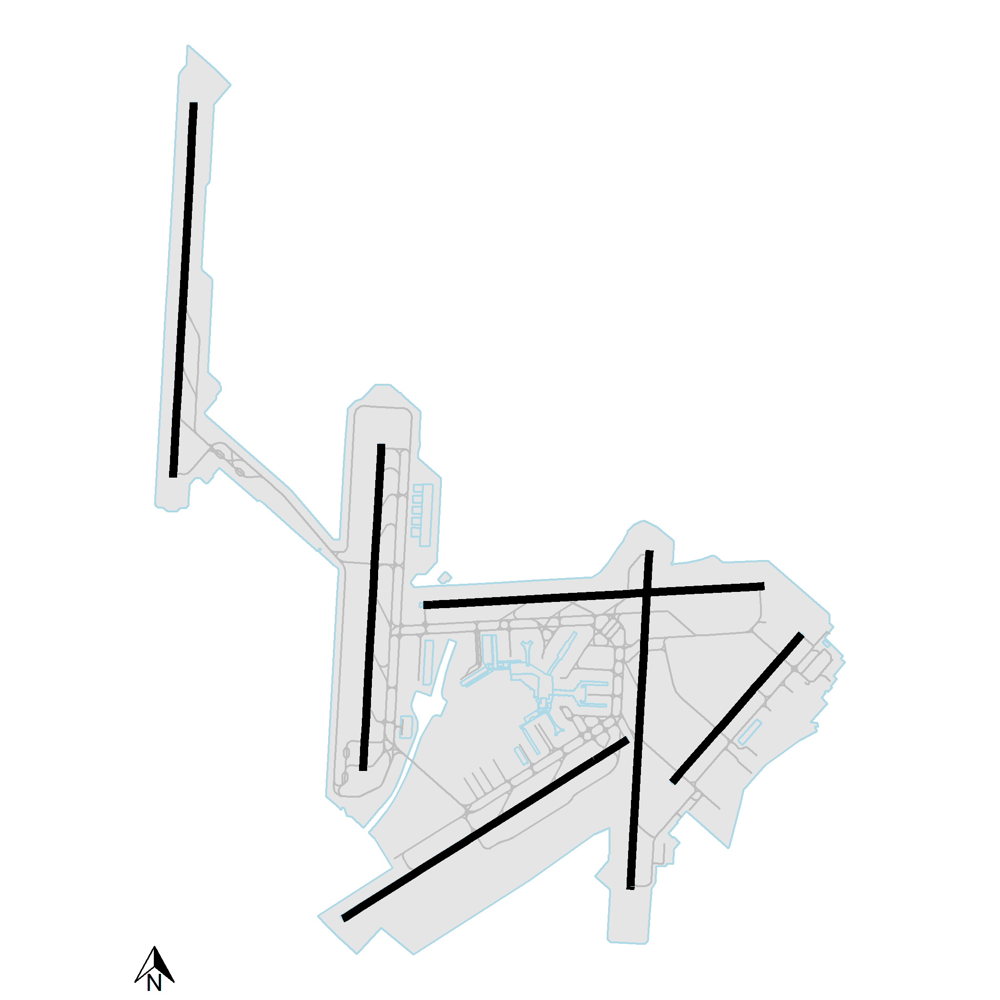
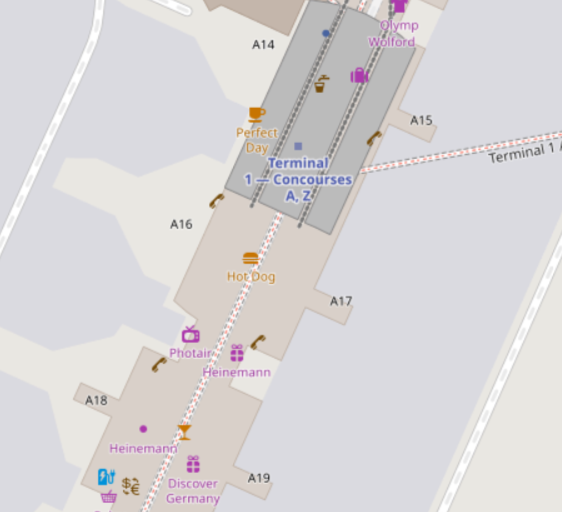
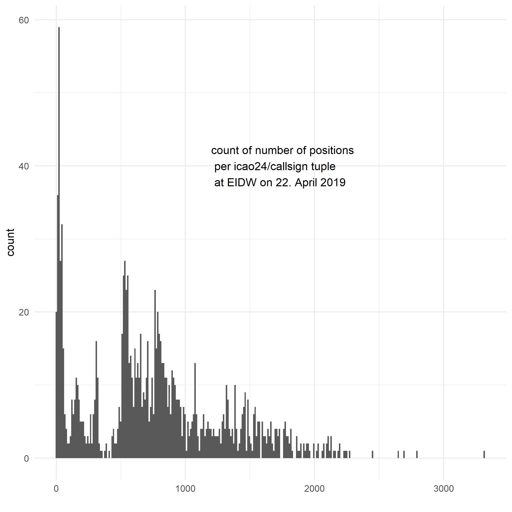
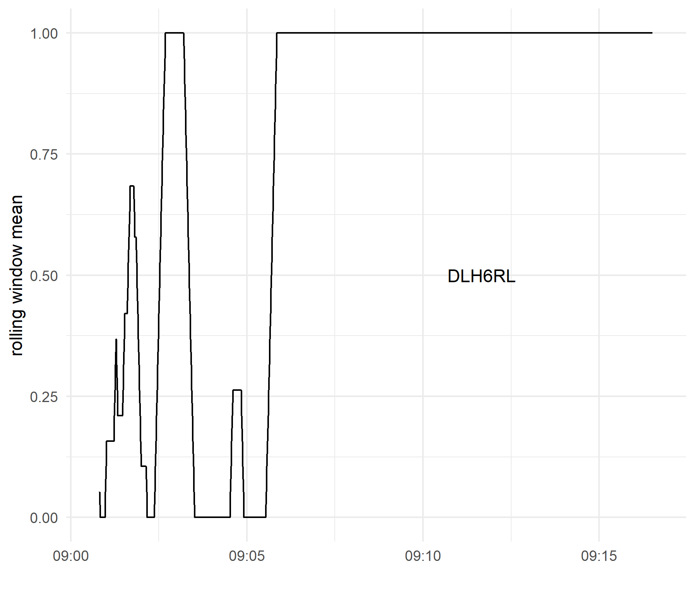
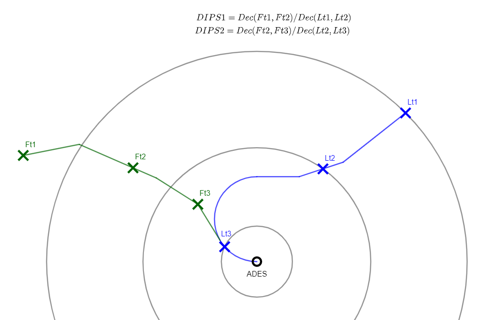

```{r setup, include=FALSE}
knitr::opts_chunk$set(echo = TRUE)
library(tidyverse)
```

# Abstract

The continued growth of air transportation is posing political and societal challenges. 
At the same time major transformation programmes are underway across the globe with a view to enhance the efficiency of air transportation and reduce the environmental footprint.
Following their development initial concepts and technological enablers are now deployed at various locations. 
In particular, the impact of air transportation and air navigation system performance at airports has gained high visibility. Growth projections at major airports highlight the need for higher levels of efficiency. However, access to operational data to validate the research or business claims, or even validate the observed performance benefits is limited. 

This paper studies the use of open data to close the gap and remove the information imbalance between air traffic managment and pubic debate. 
The work focuses on how the operational efficiency of airport airside operations, including the potential benefit of the recent introduction of enhanced arrival management practices within the European context can be measured.
The operational data is extracted from community fed open data sources. 
Data from a community network for ADSB and multi-lateration based surveillance data serves as input to advanced data analytics to augment the current set of performance indicators. 
The use case analyses are compared to the regular performance monitoring in Europe and the current proposed GANP performance measures. 
The results obtained confirm the general feasibility of applying and combining open data sources for performance analyses within the airport context. 
This provides a toolset that enables the validation of on-going deployment activities and make such analyses accessible to the public, interested researchers or experts, but also in support of the political debate. 
In particular with a view to the recent discussion on environmental sustainability, the push for reproducibility of claimed or reported performance benefits will call for higher levels of transparency and data access. 
Furthermore, emerging data analytical paradigms offer the opportunity to augment the current performance measurement framework. 
The research presented in this paper covers the work of the Performance Review Unit with a view to establishing an open performance reference trajectory for operational analysis. 
With the emergence of community collected and widely shared air transportation data, the focus will shift away from data inaccessibility to transparency and reproducibility of the data analyses. 
In this respect the work is also in support of developing an eco-system for operational performance analyses under the umbrella of the ICAO GANP work on performance.

# Introduction

<!-- high-level picture -->

The continual growth of air transportation is posing political and societal challenges. Throughout the recent years there has been a debate to what extent the funding of the on-going transformation programmes have resulted in tangible system improvements. Prevailing operational limits on one hand, but also the emerging societal pressure in terms of environmental sustainability on the other hand are a concern for political decision-makers and strategic planers. To address the political debate, ICAO is promoting a performance-based approach through its Global Air Navigation Plan (GANP) and associated building blocks of the future air transportation system. The performance-based approach builds on data analytics to increase the transparency in terms of bottleneck identification or observed performance benefits from novel operational concepts or deployed technical enablers. 

The International Civila Aviation Organization (ICAO) provides high-level guidance on measuring performance in its Manual on ANS Performance [@icao_doc9883_2009].
This has now been complemented with a set of proposed Key Performance Indicators (KPIs) to harmonise the global approach to measuring performance.
Within the European context, slight variations of these indicators are used for the regular monitoring under the EUROCONTROL Performance Review System and the Single European Sky Performance and Charging Scheme. 

To meet the challenges of the continual growth, major transformation programmes are underway across the globe and the last years have seen a series of deployments at various locations. 
With the increasing focus on XXXX however, the access to supporting data and results is often limited. 

The advent of ADSB data offer an opportunity for wider access to the data. 
In particular this technology offers access to trajectory data by researchers and data scientists in aviation and air traffic management.
Accordingly, the continued development ... helps to harmonise approaches to data analytics. 
Recent advances in artificial intelligence and machine learning can benefit from access to data.

The reproducibility paradigm and data sharing philosophy are a cornerstone of advancing the state of the art.

For example, @schultz_2020 postulates an ADSB-lite concept with a view to the costs involved in implementing airport collaborative decision-making (ACDM) at smaller airports.
@olive_2019 developed a toolbox for the analysis of air traffic data.
The Performance Review Unit (PRU) is actively marketing an open reference trajectory project for the benefit of higher transparency in the operational monitoring of performance in Europe.

Popular platform Opensky Network (OSN) [@osn_2014].


<!-- contribution -->
The contributions of this paper are as follows:

* an applied use-case of the reproducibility paradigm by providing the paper and underlying data for interested researchers to verify and replicate the results presented in this paper;
* an initial validation of the fitness of open community collected data for the purpose of performance monitoring and reporting;
* worked example of replicating performance measures at study airports and develop a measure for delay absorption in the en-route phase.


# Background/Context

While there never existed a disagreement about the fact that air transport / air traffic engineering requires access to data for developing advanced models or verify and validate reported results, the actual access to the data is traditionally sparse.
To advance the state-of-the-art, studies and results should be made reproducible to support comparability between studies and diverging conclusions.
A possible way to do this is to share data and analytical tools, and allow other researchers and practitioners to reproduce the results and validate the conclusions based on the shared work [@koelle_opendata_2017].
The status and access to data in air transportation research has been analysed by @bourgois_2014.
This study found that a significant part of air traffic data is collected and archived by state organizations.
Within the operational context the data is kept in line with prevailing safety rules and requirements. 
Technical support and research groups may store the data for longer periods with a view of reusing the data for different projects. 
Data sharing policies limit the wider use or open sharing of data.
This also applies to transformation programs like SESAR in Europe and NextGen in the United States.
Developments are widely marketed in news outlets and flyers. 
However, traffic samples used in the associated simulations or live demonstrations are typically not made available publicly.
Although more recent initiatives require recipients of public funding to share data many research programs allow grantees to opt-out on grounds of intellectual property rights, declared sensitivity of the data, or when the sharing of data poses a risk to the project or national/organizational security.

<!-- emergence of open data and communities -->
The emergence of aviation related communities of interest is closely linked with the pervasive use of the internet.
By tradition there have always been aviation enthusiasts and techy-savvy individuals interested in many facets of aviation and the air-ground data communication of aircraft [@koelle_opendata_2017].
It is impossible to list all fields aviation enthusiasts engage with. Activities entails aircraft spotting, aircraft information (e.g. life-cycle) archiving, airports and airlines statistics.
The second group's focus is on signal detection and reception. Originally starting off with aircraft messaging and air traffic control radio telephony.

Further applications developed and were supported by web-collaboration and crowd-sourcing. 
For example, establishing a repository of aircraft utilisation by tracking the aircraft from its roll-out and test flights to retirement.

Another driving force accelerating the developments is the flight simulation community.
The advent of highly configurable flight simulator software resulted in large-scale developments establishing realistic scenario support for the software.
This includes an ever increasing set of virtual replicas of airports to provide the gamer with the respective context.

Last but not least the predominantly private flying community started using the internet.
Applications range from shared training and reference material for mastering the flying skills through to more flight planning 

** provide example of Flysoft etc.

In the latter domain the regulatory context is still an obstacle for the wider use of modern technology.
In most of the European countries, flight planning is only considered 

Outside the aviation community similar developments took place. 
From a geographic information perspective Google maps (https://www.google.com/maps) revolutionized the way cartographic information is accessible to the public. 
However, there are license rights and potential access limits that constrain the use of google maps for other applications. 
OpenStreetMap (https://www.openstreetmap.org/) originates back to 2004 when many geographic information data sources were owned and controlled by government organisations [@osm_2020]. 
The idea behind OpenStreetMap builds on a free and community crowdsourced model in comparison to Google maps.
The editable map is built by the community and released with an open-content license.

# Methodology

## Reproducible Research and Analysis

Throughout the recent years the call for reproducibility has gained a higher momentum.
While reproducibility is a fundamental trait of research and the scientific method, many scientific studies are difficult to validate. 
As mentioned above, this equally applies to the air traffic management domain.
A key motivation for reproducibility is the open expossure of the data and methods. This enables a dialogue and discourse with interested researchers or professionals. Moreover, this dialogue supports the identification of potential logical or mathematical flaws.
For example, spectacular omissions and mistakes have been oberved in psychology, biomedical science, and medicine. This is highlighted in @harris_2017, but the lessons learned can be translated to other disciplines. 
Accordingly, different disciplines and reknown journals are increasingly requiring authors to provide the data next to the publication.
With Fig. \@ref(fig:reproducibility-spectrum) this is a move towards more reproducible results.

(ref:reproducibility-spectrum) Reproducibility (c.f. [@marwick_reprospectrum_2017])

```{r reproducibility-spectrum, fig.cap="(ref:reproducibility-spectrum)", out.width="100%", fig.pos="ht", echo=FALSE}

```

Within air transportation and air traffic management research the concept of reproducibility is still in its early infancy stage.
The topic was first articulated at the 2017 ATM Seminar in Seattle.
Spinielli and Koelle published a paper demonstrating the replicability of the research pipeline in XXX. 
Following this thread, the draft of this paper and its underlying data is openly available via https://github.com/rainer-rq-koelle/paper-2020-ICNS. The repository also entails supporting documentation to enable a researcher to reproduce the results and verify the used methods and mathematical transformations.
During the 1st Conference on Artificial Intelligence and Data Analytics in Air Transportation (February 2020, Singapore) a good part of the papers pointed to respective repositories on github or other web platforms supporting the sharing of the underlying data and code.


During the SESAR Innovation Days, December 2019, a wider discussion took place about the availability of data for research.
This is combined with a wider call to open data for air transportation and air traffic management research.


Within the field of air transportation and air traffic initial implementations are emerging.
Related to our work is **traffic**, a Python based toolbox for the trajectory based analytics [@olive_2019].

## Approach

<!-- 
* develop diagram showing activities (left col), results/findings (middle col), and contributions (right col)
* or schematic about artefacts (c.f. paper with data model shared with Martin/OSN and Enrico)
-->

Fig. \@ref(fig:approach-study) depicts the principal approach chosen for this feasibility study.

(ref:approach-study) Overview of the approach

```{r approach-study, fig.cap="(ref:approach-study)", out.width="50%", fig.pos="ht", echo=FALSE}

```


This paper utilises the aircraft data base developed by @sun_adsbdb_2020 and @osn_2014.
Both data bases are built on the received identifications transmitted by aircraft.
Next to the unique ICAO 24-bit id and aircraft registration, both data bases contain additional meta-information, e.g. aircraft type, operator.
For the comparison of the open data with the EUROCONTROL performance monitoring data the 24-bit address, registration, and aircraft type had been used as matching keys.

ADSB data provides for measured signals that support the reconstruction of actual flown trajectories.
Trajectories are a mathematical mapping describing the temporal-spatial motion of objects with
a finite list of parameters [@olive_2019]. 
In particular, a trajectory is a mapping function from the temporal space, $T \subseteq \mathbb{R}$, to the three dimensional geographical space $\mathbb{R}^3$.
We generalise the concept of a trajecory to a single flight of an aircraft from its departure (ADEP) to destination (ADEP) aerodrome. The trajectory is described as a set of 4-positions, i.e. timestamp indexed latitude, longetude, and altitude information.

For the first part of this paper we use community-fed ADSB data downloaded from Opensky Network.
The API provides an interface to access so-called state vectors which provide the following trajectory features:

* aircraft identification
* timestamp
* latitude, longitude, and altitude.

The data comprises also fields for ground speed, track angle and vertical rate. 

The state vectors combine different ADSB messages received throughout the sampling cycle and are available with a one-second update rate. 
Different message types are used during flight and on the ground to transmit the aircraft position and status.
For example, for position and altitude during flight, the aircraft transmits **airborne position messages** (types 9 - 18 or 20 - 22) and **airborne velocity** is transmitted as message type 19. While operating on the ground, message types 5-8 transmit both **surface position** and movement. According to the ADSB message standard there is no altitude information in message types 5-8. The set of messages also offer an on/off-ground flag [@sun_adsbbook_2017]. Dependent on the processing of the data and its aggregation in the state vector, various combinations of altitude information and on/off-ground have been seen for different aircraft. 
The noise effect may also be the result of garbled messages or signal distortions and interference.
The second part of this paper makes use of Correlated Position Reports (CPR). CPRs are service provider reported postions offering the same features as the ADSB/multilateration data. 
CPRs are sampled on a 30 second basis and represent a widely pre-processed data set. 
The longer-term assessment performed did not allow to make use of the ADSB data as the download of multiple years would have been prohibitive. 


ACDM-lite [@schultz_acdmlite_2019, @schultz_2020]


# Results 

## Environmental Data

For some states aeronautical information is available via the internet.
For example, the Dutch air traffic service provider LVNL pubishes the AIP for The Netherlands via a web-portal (https://www.lvnl.nl/eaip/2020-02-13-AIRAC/html/index-en-GB.html) and offers a downloadable version via a separate link.
Information on aerodromes can be found in the Part 3, Aerodromes. As the information is provided as html pages, related information can be extracted. However, aerodrome charts are still included as additional pdf files.

For this paper we defaulted for the aerodrome charting to OpenStreetMap.
For the interested reader, the principal cartographic information available via OpenStreetMap can be queried via an online viewer (https://overpass-turbo.eu/). By visual inspection a first impression of the available information can be gained.

To further automate the data extraction we developed a query to define a bounding box around the aerodrome reference point.
With these dimensions the following code extracts the data from the OpenStreetMap server.
The information can be used to draw the aerodrome layout depicted in Fig. \@ref(fig:aerodrome-chart).
As part of the geopgraphic information also stand identification can be retrived from OpenStreetMap (c.f. Fig. \@ref(fig:aerodrome-zoom-stands)).

(ref:aerodrome-chart) Example of an aerodrome chart, i.e. Amsterdam Schiphol (EHAM)

```{r aerodrome-chart, fig.cap="(ref:aerodrome-chart)", out.width="50%", fig.pos="h", echo=FALSE}

```

(ref:aerodrome-zoom-stands) Information on stand/gate from OpenStreetMap [@osm_2020]. 

```{r aerodrome-zoom-stands, fig.cap="(ref:aerodrome-zoom-stands)", out.width="50%", fig.pos="h", echo=FALSE}

```

The OSM data specification entails slots for labelling geographic data points.

## Trajectory Data Coverage

For this study data from Opensky Network was downloaded for Frankfurt Rhine/Main airport, EDDF, and Dublin airport(EIDW).
The downloaded data covered a period of 4 weeks, i.e. 22. April - 19 May.
The ADSB trajectory data is downloaded from Opensky Network in form of so-called *state vectors*.
A state vector comprises the information associated with the aircraft ICAO 24-bit address.
It represents a time-binned representation of the flight derived from ADSB and Mode-S messages.
The Opensky Network API is documented at https://opensky-network.org/apidoc/rest.html.
The interface supports the download of specific aircraft icao24 identifications or the batch download of all data within a specific bounding box. 
Fig. \@ref(fig:download-eidw) shows the number of 4D positions downloaded from Opensky Network for the first day of this study, i.e. 22. April 2019.
The distributions shows that a significant number of distinct unique aircraft id codes with a low number of 4D positions has been downloaded. 
By definition such flights are likely to be overflights transversing the area of the defined bounding box.

(ref:download-eidw) Number of position reports downloaded for EIDW (22. April 2019)

```{r download-eidw, fig.cap="(ref:download-eidw)", out.width="50%",fig.pos="h", echo=FALSE}

```

The downloaded data provides for 4D positions. For the calculation of performance indicators respective timestamps marking specific movements events needed to be generated.
These events include:

* first and last position - identification of the first and last measured position to support the identification of coverage or filter data 
* surface movement events - given the coverage, identification of start of taxi, end of taxi, and runway movement times, i.e. actual take-off time in case of departures and actual landing time in case of arrivals.

Although the ADSB standard suggests a clear cut-off of altitude information during the ground part of a trajectory, the data contained various combinations of data for altitude, velocity, vertical rate, and onground flag. 
To reduce the number of case distinctions, a sliding window approach has been used to identify the runway movement event.
Fig. \@ref:(fig:rolling-window) shows an example for the determination of the actual take-off time.
For the departure in question, DLH6RL, several extreme spikes have been observed during the taxi portion.
The sliding window allowed to smoothen out the noisy onground and altitude information allowing the identification of a clear cut-off for the actual take-off.
The shown examples uses a window size of n = 11 successive postion reports (1 second) calculating the mean (simple moving average):

\begin{equation}     
isTakeOff =\frac{\sum^{n-1}_{i=0}{  isTakeOff_i }}{n}
(\#eq:sma)
\end{equation}


A veriety of other smoothing approaches were tested, however, given the nature of the data and balancing processing time for large datasets, the simple moving average \@ref(eq:sma) provides robust results.


(ref:rolling-window) Determination of the Actual Take-Off Time

```{r rolling-window, fig.cap="(ref:rolling-window)", out.width="50%", fig.pos="h", echo=FALSE}

```


## Aerodrome Performance Indicators

To demonstrate the principal feasibility, this paper replicates two of the currently used ANS performance indicators for the airport environment.

### Additional Time in Terminal Airspace

The additional time in the terminal airspace is defined as the average of the additional time of arriving traffic observed between the entry within the terminal airspace and landing.
The additional time is determined based on the difference between the observed actual travelling time and a respective reference time for the arrival entry sector, landing runway, and aircraft class, c.f \@ref(eq:addASMA).

\begin{equation}     
(\#eq:addASMA)
avgAddASMA =\frac{\sum_{f_i}{  actualASMA_i - refASMA_{(class,entry,rwy)}  }}{\sum_{f_i}{i}}
\end{equation}

As mentioned above, for Dublin (EIDW) the coverage did not allow to measure landing times.
Accordingly, a proxy for the arrival process **end time** is determined with the 8NM gate.
At this moment in time aircraft are established on final.
It is assumed that the remaining flight time is a systemic time elapsing that is captured by the difference between the travel times and reference times measured with landing timestamps.
Table \@ref(tab:asma-eidw) shows the numerical results for this study and aforementioend approximisation.
For EIDW an average additional ASMA time of 3.64 min/arrival is measured.

(ref:asma-eidw) additional ASMA time measured with OSN data

```{r asma-eidw, echo=FALSE, message=FALSE}
asma_eidw <- readr::read_csv("./data/EIDW-study-ASMA.csv")
knitr::kable(
  asma_eidw, booktabs = TRUE,
  caption = '(ref:asma-eidw)'
)
```

### Additional Taxi-Out Time

The additional taxi-out time is defined as the average of the additional taxi-out times of all departing aircraft.
The additioanl taxi-out time of an individual flight is determined as the difference between the observed actual taxi-out time and an associated reference taxi-out time [@pru_addTXOT_2015].
Taxi out is defined as the time elapsing between the actual off-block and actual take-off of an aircraft.
Accordingly, this metric requires the identification of these surface movement events.
It follows from the previous section that taxi-times cannot be derived from the OSN data feed for Dublin (EIDW) at the time being. This section reports on results for Frankfurt Rhine/Main airport (EDDF)

\begin{equation}     
(\#eq:addTXOT)
avgAddTXOT =\frac{\sum_{f_i}{  actualTXOT_i - refTXOT_{(stand,rwy)}  }}{\sum_{f_i}{i}}
\end{equation}


see \@ref(eq:addTXOT)

Table \@ref(tab:txot-eddf) shows the numerical results for this study.
A critical element that requires further analysis is the influence of aircraft for which not stand could had been identified.
This paper applies a grouping approach. Stands located in close proximity are considered as one stand cluster.
Approximately 70% of the traffic was corrently identified in terms of parking positions.
The identification of the used runway was done on the basis of a simple position fix for the take-off event.
With these approximations, an average additional ASMA time of 4.61 min/departure is measured.
This overall results also ranges within the data published by the PRU.

(ref:txot-eddf) additional txot time measured with OSN data

```{r txot-eddf, echo=FALSE, message=FALSE}
txot_eddf <- readr::read_csv("./data/EDDF_analytic_txot.csv")
knitr::kable(
  txot_eddf, booktabs = TRUE,
  caption = '(ref:txot-eddf)'
)
```


# Results - arrival management (en-route delay absorption)

With this feasibility study an approach to the measurement of enroute delay absorption is performed.
As mentioned above, the following results are based on CPRs.
Conceptually, en-route delay absorptions is designed to reduce the required sequencing within the terminal area (approximated by the ASMA 40NM cylinder).
Associated sequencing time (e.g. procedural holding, point merge procedures, vectoring) is escalated upstream in terms of speed reductions.
This allows to operate the aircraft within certain margins of its operational envelope at higher altitudes with considerable lower fuel burn than holding or vectoring at lower altitudes.
For this purpose a Deceleration Indicator for flight PairS (DIPS) has been created to monitor arrival management performance.
At the time being so-called arrival manager systems (AMAN) and extend arrival management systems (XMAN) are deployed for major European airports. 

The indicator considers pairs of aircraft, arriving on the same airport, one after the other. To measure performance in the terminal arrival space around an airport 4 intermediate sequencing horizons have been defined in relation to the aerodrome reference point:

* horizon III: airspace ranging from 400NM to 200NM;
* horizon II: airspace ranging from 200NM to 100NM;
* horizon I: airspace ranging from 40NM to 100NM; and
* terminal airspace: airspace ranging from 40NM to 8NM.

The 8NM intersection serves as a proxy for the ILS intersection which is considered the end point for the delay absorption. 
Once an aircraft is established on its final approach flight sequencing is typically limited to the safety of flight or emergency handling.

Similar to the additional ASMA time indicator introduced above, flights landing on the airport are grouped per landing runway. Their relationship is expressed in terms of leader and follower per sequence of landing. 
The 4D flight profile attributes for a flight are captured whenever it enters an area of interest. 
For a couple of flights this means that whenever a leader crosses an area of interest its attributes are noted. Also, the attributes for the follower are captured for the same moment when the leader crossed the threshold of the area. In this way, it is possible to monitor the paramaters of the leader versus the follower throughout a time period.
DIPS is defined as the ratio between the deceleration of the follower versus the deceleration of the leader taking into account the same time interval. So, if a leader crossed the 400 NM threshold at t1 point in time, and then flew over the 200 Nm threshold at t2 point in time, then DIPS measures the sum of deceleration from t1 to t1 for the leader, and then calculates the sum of deceleration of the follower in the time period from t1 to t2, and present the ratio between the two.
Overall it is expected that the indicator will show an increasing trend if the follower is being slowed down more than the leader is being slowed down and vice versa.
Fig. \@ref(fig:dips) shows the concept of the decelartion indicator.

(ref:dips) Deceleration indicator concept

```{r dips, fig.cap="(ref:dips)", out.width="50%", fig.pos="h", echo=FALSE}

```


# Conclusions

This paper demonstrates the feasibility of utilising open data sources for performance monitoring at and around airports.
This paper builds on the reproducibility paradigm by utilizing open community collected operational data and provides the data analytical documentation to enable an interested researcher or expert to replicate the analysis. 
Through this approach, performance claims are verifiable and a toolset to achieve higher levels of transparency for the political debate and strategic planning becomes available.

* what was shown

* weaknesses and strengths 

<!-- relevance of results -->

The results obtained confirm the general feasibility of applying and combining open data sources for performance analyses within the airport context. This provides a toolset that enables the validation of on-going deployment activities and make such analyses accessible to the public, interested researchers or experts, but also in support of the political debate. In particular with a view to the recent discussion on environmental sustainability, the push for reproducibility of claimed or reported performance benefits will call for higher levels of transparency and data access. Furthermore, emerging data analytical paradigms (e.g. machine learning) offer the opportunity to augment the current performance measurement framework. The research presented in this paper covers the work of the Performance Review Unit with a view to establishing an open performance reference trajectory for operational analysis. With the emergence of community collected and widely shared air transportation data, the focus will shift away from data inaccessibility to transparency and reproducibility of the data analyses. In this respect the work is also in support of developing an eco-system for operational performance analyses under the umbrella of the ICAO GANP work on performance.

* application of results

# Disclaimer

The views expressed in this paper are the authors' own and do not reflect a position or policy of EUROCONTROL.

# Acknowledgments

This work was conducted under the auspices of the Performance Review Commission of EUROCONTROL and the preparatory action of establishing an open reference trajectory for performance monnitoring in Europe.
The authors further want to thank the Opensky-Network community.
Thansk go also to OpenStreetmap. Map data copyrighted OpenStreetMap contributors and available from https://www.openstreetmap.org.

# Reproducibility

This paper is fully reproducible. The underlying Rmarkdown file, the supporting data preparatory and analytical scripts are available at: https://github.com/rainer-rq-koelle/paper-2020-ICNS.

# References

