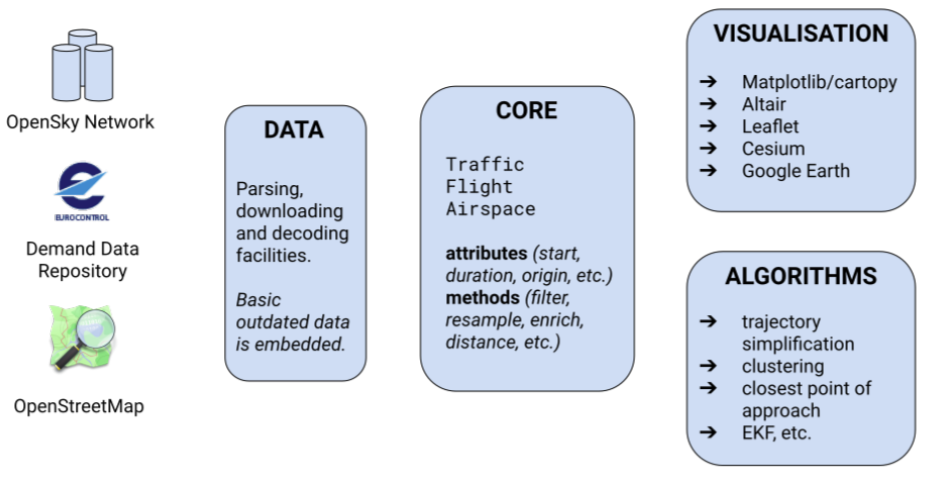

```{r setup, include=FALSE}
knitr::opts_chunk$set(echo = TRUE)
```

...
Major transformation programmes are underway across the globe and are now deployed at various locations. The impact of air transportation and air navigation system performance at airports has gained high visibility. Growth projections at major airports highlight the need for higher levels of efficiency. However, access to operational data to validate the research or business claims, or even validate the observed performance benefits is limited. 
... 
This paper studies the operational benefits of two recent deployments for enhanced arrival management practices within the European context. In particular, the point-merge procedure is contrasted with extended arrival management and delay absorption outside the terminal airspace. The operational data is extracted from community fed open data sources. Data from a community network for ADSB and multi-lateration based surveillance data serves as input to advanced data analytics (e.g. machine learning) to augment the current set of performance indicators. The use case analyses are compared to the regular performance monitoring in Europe and the current proposed GANP performance measures. The results obtained confirm the general feasibility of applying and combining open data sources for performance analyses within the airport context. This provides a toolset that enables the validation of on-going deployment activities and make such analyses accessible to the public, interested researchers or experts, but also in support of the political debate. In particular with a view to the recent discussion on environmental sustainability, the push for reproducibility of claimed or reported performance benefits will call for higher levels of transparency and data access. Furthermore, emerging data analytical paradigms (e.g. machine learning) offer the opportunity to augment the current performance measurement framework. The research presented in this paper covers the work of the Performance Review Unit with a view to establishing an open performance reference trajectory for operational analysis. With the emergence of community collected and widely shared air transportation data, the focus will shift away from data inaccessibility to transparency and reproducibility of the data analyses. In this respect the work is also in support of developing an eco-system for operational performance analyses under the umbrella of the ICAO GANP work on performance.

# Introduction

<!-- high-level picture -->

The continual growth of air transportation is posing political and societal challenges. Throughout the recent years there has been a debate to what extent the funding of the on-going transformation programmes have resulted in tangible system improvements. Prevailing operational limits on one hand, but also the emerging societal pressure in terms of environmental sustainability on the other hand are a concern for political decision-makers and strategic planers. To address the political debate, ICAO is promoting a performance-based approach through its Global Air Navigation Plan (GANP) and associated building blocks of the future air transportation system. The performance-based approach builds on data analytics to increase the transparency in terms of bottleneck identification or observed performance benefits from novel operational concepts or deployed technical enablers. 

Manual on ANS Performance [@icao_doc9883_2009].

To meet the challenges of the continual growth, major transformation programmes are underway across the globe and the last years have seen a series of deployments at various locations. 
With the increasing focus on XXXX however, the access to supporting data and results is often limited. 

The advent of ADSB data offer an opportunity for wider access to the data. 
In particular this technology offers access to trajectory data by researchers and data scientists in aviation and air traffic management.
Accordingly, the continued development ... helps to harmonise approaches to data analytics. 
Recent advances in artificial intelligence and machine learning can benefit from access to data.

The reproducibility paradigm and data sharing philosophy are a cornerstone of advancing the state of the art.

For example, @schultz_2020 postulate an ADSB-lite concept with a view to the costs involved in implementing airport collaborative decision-making (ACDM) at smaller airports.
@olive_2019 developed a toolbox for the analysis of air traffic data.
The Performance Review Unit (PRU) is actively marketing an open reference trajectory project for the benefit of higher transparency in the operational monitoring of performance in Europe.

Popular platform Opensky Network (OSN) [@osn_2014].


<!-- contribution -->
The contributions of this paper are as follows:

* an applied use-case of the reproducibility paradigm by providing the paper and underlying data for interested researchers to verify and replicate the results presented in this paper;
* an initial validation of the fitness of open community collected data for the purpose of performance monitoring and reporting;
* worked example of replicating performance measures at study airports and develop a measure for delay absorption


# Background/Context

While there never existed a disagreement about the fact that air transport / air traffic engineering requires access to data for developing advanced models or verify and validate reported results, the actual access to the data is traditionally sparse.
The status and access to data in air transportation research has been analysed by @bourgois_2014.

<!-- emergence of open data and communities -->
The emergence of aviation related communities of interest is closely linked with the pervasive use of the internet.
By tradition there have always been aviation enthusiasts and techy-savvy individuals interested in the data communication of aircraft [@koelle_opendata_2017].
The first group's focus was on photography. The latter on signal detection and reception.

Further applications developed and were supported by web-collaboration. For example, establishing a repository of aircraft utilisation by tracking the aircraft from its roll-out and test flights to retirement.

Another driving force accelerating the developments is the simulation community.
The advent of highly configurable flight simulator software resulted in large-scale developments establishing realistic scenario support for the software.
This includes an ever increasing set of virtual replicas of airports to provide the gamer with the respective context.

Last but not least the predominantly private flying community started using the internet.
Applications range from shared training and reference material for mastering the flying skills through to more flight planning 

** provide example of Flysoft etc.

In the latter domain the regulatory context is still an obstacle for the wider use of modern technology.
In most of the European countries, flight planning is only considered 

Outside the aviation community similar developments took place. 
(VERBATIM) OpenStreetMap is a free, editable map of the whole world that is being built by volunteers largely from scratch and released with an open-content license.(VERBATIM)

*

*


# Methodology

## Reproducible Research and Analysis

Throughout the recent years the call for reproducibility has gained a higher momentum.
Different disciplines and reknown journals are increasingly requiring authors to provide the data next to the publication.

Within air transportation and air traffic management research the concept of reproducibility is still in its early infancy stage.
The topic was first articulated at the 2017 ATM Seminar.
Spinielli and Koelle published a paper demonstrating the replicability of the research pipeline in XXX. The paper and its underlying data is openly available via https://XXX.
During the SESAR Innovation Days, December 2019, a wider discussion took place about the availability of data for research.

Within the field of air transportation and air traffic initial implementations are emerging.
Related to our work is **traffic**, a Python based toolbox for the trajectory based analytics [@olive_2019].

## Process

* add figure of workflow

## Approach

* develop diagram showing activities (left col), results/findings (middle col), and contributions (right col)
* or schematic about artefacts (c.f. paper with data model shared with Martin/OSN and Enrico)

Fig. \@ref(fig:approach-toolbox) shows SOMETHING COOL.

(ref:approach-toolbox) Overview of the Approach

```{r approach-toolbox, fig.cap="(ref:approach-toolbox)", out.width="50%", fig.pos="ht", echo=FALSE}

```


This paper utilises the aircraft data base developed by @sun_adsbdb_2020.

ADSB data provides for measured signals that support the reconstruction of actual flown trajectories.
(VERBATIM)Trajectories are mathematical objects used to describe the evolution of a moving object with
a finite list of parameters [@olive_2019] (END VERBATIM).
We generalise the concept of a trajecory to a single flight of an aircraft from its departure (ADEP) to destination (ADEP) aerodrome. The trajectory is described as a set of 4-positions, i.e. timestamp indexed latitude, longetude, and altitude information.


Opensky Network state vector provides the following trajectory features:

* aircraft identification
* timestamp
* latitude, longitude, and altitude.

The data comprises also fields for ground speed, track angle and vertical rate. 


ACDM-lite [@schultz_acdmlite_2019, @schultz_2020]


# Results 

## Environmental Data

For some states aeronautical information is available via the internet.
For example, the Dutch air traffic service provider LVNL pubishes the AIP for The Netherlands via a web-portal (https://www.lvnl.nl/eaip/2020-02-13-AIRAC/html/index-en-GB.html) and offers a downloadable version via a separate link.
Information on aerodromes can be found in the Part 3, Aerodromes. As the information is provided as html pages, related information can be extracted. However, aerodrome charts are still included as additional pdf files.

For this paper we defaulted for the aerodrome charting to OpenStreetMap.
For the interested reader, the principal cartographic information available via OpenStreetMap can be queried via an online viewer (https://overpass-turbo.eu/). By visual inspection a first impression of the available information can be gained.

To further automate the data extraction we developed a query to define a bounding box around the aerodrome reference point.
With these dimensions the following code extract the data from the OpenStreetMap server.
The information can be used to draw the aerodrome layout depicted in Fig. \@ref(fig:aerodrome-chart).

(ref:aerodrome-chart) Example of an aerodrome chart, i.e. Amsterdam Schiphol (EHAM)

```{r aerodrome-chart, fig.cap="(ref:aerodrome-chart)", out.width="50%", fig.pos="h", echo=FALSE}
knitr::include_graphics("figures/EHAM.png")
```


## Replicating Aerodrome Performance Indicators

To demonstrate the principal feasibility, this paper replicates two of the currently used ANS performance indicators for the airport environment.

The additional taxi-out time is defined as the average of the additional taxi-out times of all departing aircraft.
The additioanl taxi-out time of an individual flight is determined as the difference between the observed actual taxi-out time and an associated reference taxi-out time [@pru_addTXOT_2015].

\begin{equation}     
(\#eq:addTXOT)
avgAddTXOT =\frac{\sum_{f_i}{  actualTXOT_i - refTXOT_{(stand,rwy)}  }}{\sum_{f_i}{i}}
\end{equation}


see \@ref(eq:addTXOT)


# Results - arrival management (point merge vs delay absorption)

# Conclusions

This paper demonstrates the feasibility of utilising open data sources for performance monitoring at and around airports.
This paper builds on the reproducibility paradigm by utilizing open community collected operational data and provides the data analytical documentation to enable an interested researcher or expert to replicate the analysis. 
Through this approach, performance claims are verifiable and a toolset to achieve higher levels of transparency for the political debate and strategic planning becomes available.

* what was shown

* weaknesses and strengths 

<!-- relevance of results -->

The results obtained confirm the general feasibility of applying and combining open data sources for performance analyses within the airport context. This provides a toolset that enables the validation of on-going deployment activities and make such analyses accessible to the public, interested researchers or experts, but also in support of the political debate. In particular with a view to the recent discussion on environmental sustainability, the push for reproducibility of claimed or reported performance benefits will call for higher levels of transparency and data access. Furthermore, emerging data analytical paradigms (e.g. machine learning) offer the opportunity to augment the current performance measurement framework. The research presented in this paper covers the work of the Performance Review Unit with a view to establishing an open performance reference trajectory for operational analysis. With the emergence of community collected and widely shared air transportation data, the focus will shift away from data inaccessibility to transparency and reproducibility of the data analyses. In this respect the work is also in support of developing an eco-system for operational performance analyses under the umbrella of the ICAO GANP work on performance.

* application of results

# Disclaimer

The views expressed in this paper are the authors' own and do not reflect a position or policy of EUROCONTROL.

# Acknowledgments

This work was conducted under the auspices of the Performance Review Commission of EUROCONTROL and the preparatory action of establishing an open reference trajectory for performance monnitoring in Europe.
The authors further want to thank the Opensky-Network community 

# Reproducibility

This paper is fully reproducible. The underlying Rmarkdown file, the supporting data preparatory and analytical scripts are available at: https://github.com/rainer-rq-koelle/paper-2020-ICNS.

# References

